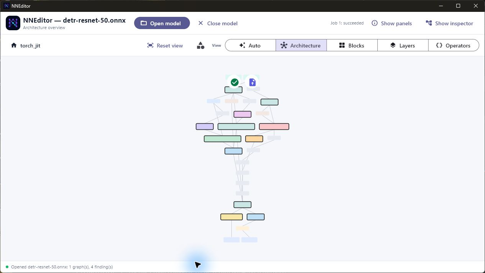
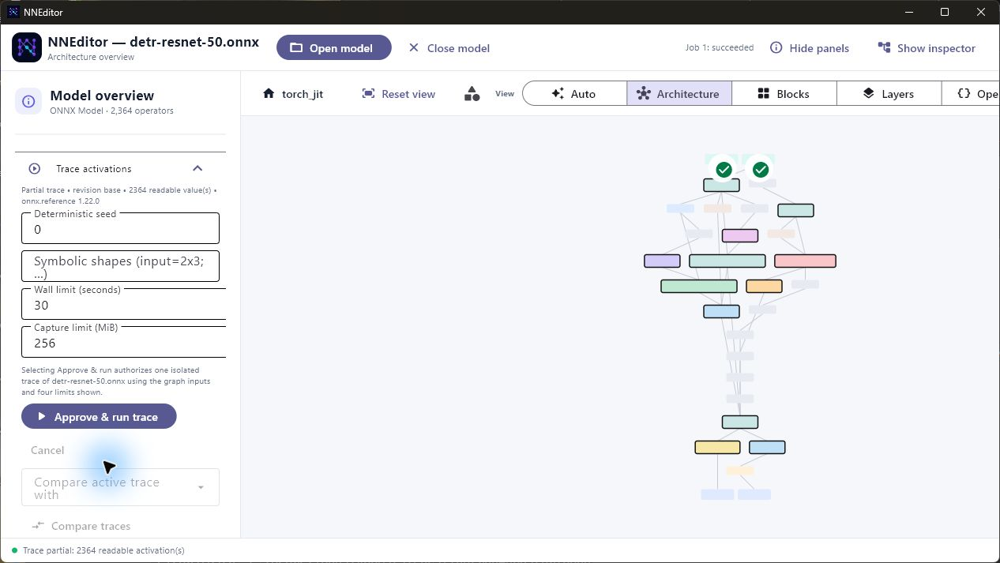
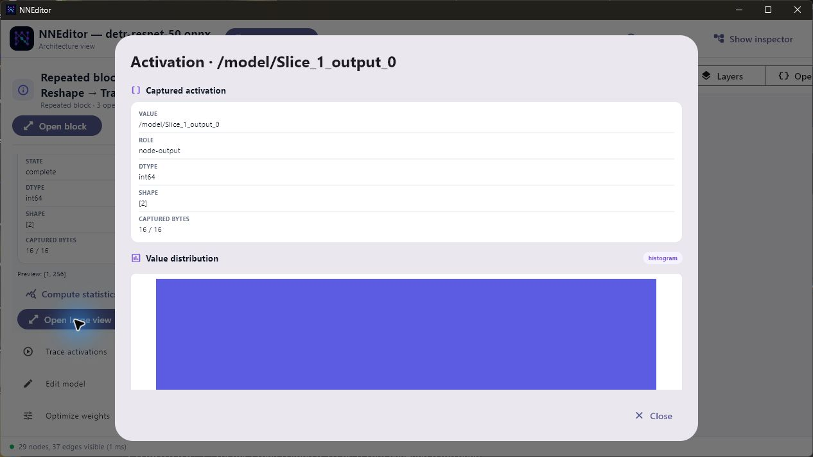

<p align="center">
  
</p>

<h1 align="center">NNEditor</h1>

<p align="center">
  Inspect, understand, edit, optimize, and trace neural-network artifacts
  without loading an entire model into memory or executing artifact-provided
  code.
</p>

NNEditor 1.0 is a capability-aware neural-network workspace for ONNX, PyTorch,
safetensors, and textual StableHLO artifacts. It combines semantic graph
navigation, lazy tensor access, reversible editing, validated export, and
desktop activation tracing in one application.

## NNEditor in action

These screenshots come from a real desktop session with the 2,364-operator
`detr-resnet-50.onnx` model. The trace used the included fox image tensor and an
automatically generated all-valid pixel mask. It reached the approved 256 MiB
capture bound, so NNEditor reported an honest partial result while retaining
2,364 readable activations.

### Navigate a model by architecture



### Run a bounded activation trace



### Open activation data in a large view



## Highlights

- Navigate large graphs through architecture, block, layer, and operator views.
- Detect attention, feed-forward, convolutional, repeated, and structural
  regions with retained evidence and explanations.
- Read embedded and external tensors lazily through bounded byte ranges.
- Inspect tensor metadata, decoded previews, heatmaps, streaming statistics,
  and paged hexadecimal data.
- Apply reversible graph and tensor changes without modifying the source
  artifact.
- Save only when needed through a dirty-aware top-bar action, or close the
  current model without quitting the application.
- Generate safe `.npy` test inputs from images, masks, CSV data, synthetic
  time series, or generic tensor patterns, then assign them to model inputs.
- Preview quantization and pruning before committing them.
- Export validated ONNX revisions or clearly labelled weights-only artifacts.
- Trace ONNX activations in an isolated desktop worker and inspect values by
  clicking nodes, blocks, connections, inputs, or outputs.
- Explain every unavailable action through an explicit artifact capability
  contract.

## Supported artifacts

NNEditor identifies artifacts by their contents, not only by their extension.
The table describes the built-in readers and the strongest release-level
workflow available for each artifact.

| Artifact | Inspection | Editing | Export | Activation tracing |
|:--|:--|:--|:--|:--|
| ONNX model, including external data | Graphs, weights, metadata | Validated graph and tensor subset | ONNX with validation and provenance | Available on desktop |
| PyTorch exported program | Graph, parameters, buffers, constraints | Parameter and buffer bytes | Weights-only safetensors | Unavailable |
| PyTorch state dictionary | Weights and tensor metadata | Tensor-level changes | Weights-only artifact | Unavailable |
| PyTorch FX graph module | Partial topology and metadata | Unavailable | Unavailable | Unavailable |
| Safetensors | Weights and header metadata | Tensor-level changes | Safetensors | Unavailable |
| Flax or Orbax checkpoint | Weights and tensor metadata | Tensor-level changes | Weights-only artifact | Unavailable |
| Textual StableHLO | Functions, regions, operations, attributes | Inspection only | Unavailable | Unavailable |

Support is intentionally capability-specific. For example, opening a checkpoint
does not imply that NNEditor can reconstruct a model graph, and reading
StableHLO does not imply that NNEditor can write the dialect back. Unavailable
actions explain the format-specific reason directly in the interface.

## Installation

NNEditor requires Python 3.12, 3.13, or 3.14.

```bash
python -m pip install nneditor==1.0.0
```

Start the desktop application with either command:

```bash
nneditor
```

```bash
python -m nneditor
```

Open a model directly from the command line:

```bash
nneditor path/to/model.onnx
```

On Windows, select **File types** in the top bar to register NNEditor for
`.onnx`, `.pb`, `.pt2`, `.pt`, `.pth`, `.ckpt`, `.bin`, `.safetensors`,
`.mlir`, and `.stablehlo` files. NNEditor then opens Windows Default apps,
where you choose which extensions should launch it. Registration is per-user
and never replaces a protected Windows default without that explicit choice.

## First run

1. Select **Open model** and choose a supported artifact. NNEditor detects its
   format from the file contents.
2. Start in the architecture view, then open a block or change the detail level
   to move through blocks, layers, and operators.
3. Select a node to inspect its ports, attributes, weights, and capability
   information.
4. Use search, breadcrumbs, the hierarchy explorer, keyboard navigation, and
   the minimap to move around large models.
5. Prepare edits or transformations in the left panel. NNEditor validates a
   preview before enabling **Commit**.
6. After a commit, **Save changes…** appears in the top bar. Select it to
   export the current revision to a new destination; it disappears after a
   successful save and returns after another change.
7. Select **Close model** to release the current artifact and return to the
   start screen without quitting NNEditor.

The opened source remains unchanged throughout this workflow. A recovered
sidecar revision is treated as unsaved and offers **Save changes…** immediately.

Large imports, statistics, exports, and traces run as cancellable background
jobs. The interface reports partial or unavailable data instead of presenting
it as complete.

## Activation tracing

Desktop tracing is available for ONNX models:

1. Open **Generate test input** to resize an image, create a mask, convert
   numeric CSV/time-series data, synthesize a signal, or create a generic
   tensor. Select a model input and use **Generate, save & assign** to return
   directly to that input node. You can also click the tensor-picker button
   inside an input node and choose an existing safe NumPy `.npy` tensor.
   Required `*_mask` inputs left unchanged use an automatically generated
   all-valid mask; other inputs use deterministic random data.
2. Open **Trace activations**, review the input specification and the
   wall-clock, memory, capture, and chunk limits.
3. Select **Approve & run trace**. This click creates an approval bound to the
   current model, inputs, and limits for that run only.
4. Click any operator, semantic block, visible connection, model input, or model
   output. NNEditor automatically builds the corresponding bounded activation
   views and shows them in the inspector.
5. Select **Open large view** on an activation card for a scrollable overlay
   containing its histogram, line view, heatmap, feature-map grid, or attention
   view, as applicable.

Ready-made image and time-series tensors are available in
[examples/trace-inputs](examples/trace-inputs).

Input tensors are checked against the model's declared dtype and shape.
Approval is created only when **Approve & run trace** is selected, so a changed
input or limit cannot reuse stale consent. The UI captures graph inputs and
operator outputs by default so inspection does not depend on the selection that
was active when the trace began.

Tracing uses the ONNX reference evaluator in a separate, resource-limited
process. A failed or cancelled run publishes no trace. Desktop subprocess
isolation is not a multi-tenant security boundary, so tracing is disabled in
the browser application until a dedicated worker service is available.

## Editing and optimization

### Validated ONNX editing

The 1.0 release supports a deliberately bounded entry-graph edit surface:

- rename nodes;
- edit supported scalar and list attributes;
- replace compatible operators;
- insert or remove validated unary operators;
- reconnect compatible inputs; and
- replace same-length tensor byte ranges.

Every change is prepared as a transaction, checked against the graph and ONNX
schema, and committed as a reversible revision. Undo, redo, recovery, diff
previews, and export provenance use the same revision chain.

### Quantization and pruning

NNEditor can preview and commit:

- 8-bit signed or unsigned, symmetric or asymmetric weight conversion;
- per-tensor and per-channel quantization;
- portable ONNX QuantizeLinear/DequantizeLinear insertion;
- threshold, mask, and exact `N:M` logical pruning; and
- a shape-proven terminal `MatMul` channel-pruning pattern.

The UI distinguishes a mathematical conversion from storage reduction or
runtime acceleration. Logical sparsity alone is never advertised as a smaller
or faster model.

## Safety and data integrity

NNEditor is safe-artifact-first:

- Import parses artifact bytes without importing or executing Python stored in
  the artifact.
- Pickle-based PyTorch containers are inspected through a restricted,
  non-executing reader.
- Source artifacts are immutable and identified by cryptographic content
  hashes.
- External tensor files are verified before their bytes are used.
- Tensor reads, caches, statistics, capture storage, and writes are bounded.
- Unsupported or ambiguous edits are rejected rather than approximated.
- Exports are staged, validated, and published as new artifacts.
- Inference requires explicit per-run approval and enforced resource limits.

## Large-model design

NNEditor avoids eager model materialization during normal inspection. Its ONNX
reader indexes protobuf wire ranges directly, tensor storage uses range reads
and bounded caches, and semantic graph levels keep the visible working set
manageable. The renderer is behind a toolkit-neutral contract and uses culling,
persistent shapes, and deterministic aggregation.

These choices make ordinary navigation responsive without pretending that an
unaggregated view containing tens of thousands of visible operators is cheap.

## Platform support

The desktop application targets:

- 64-bit Windows 10 and 11;
- macOS 12 or newer; and
- Debian 10–12 and Ubuntu 20.04, 22.04, and 24.04 LTS.

CI exercises Python 3.12, 3.13, and 3.14 on Linux and Python 3.14 on Windows.
The dynamic Flet browser application supports model inspection and editing, but
desktop-only tracing and browser multi-file export packaging remain unavailable.
Mobile packaging is outside the 1.0 release.

## Known boundaries

- Structural editing is limited to validated ONNX entry-graph cases.
- Custom or unknown operator schemas may be inspected but are not guessed
  during editing or tracing.
- PyTorch graph re-serialization and ONNX conversion are not included.
- Textual StableHLO is inspection-only.
- Weights-only exports do not contain executable topology.
- Browser tracing is disabled pending multi-user worker isolation.
- The original Python, module definitions, and training code cannot be
  reconstructed from serialized artifacts.

## Development

The development environment is managed with
[uv](https://docs.astral.sh/uv/):

```bash
uv sync --locked --group dev
```

Run the desktop application:

```bash
uv run flet run src/main.py
```

Run the browser application:

```bash
uv run flet run --web src/main.py
```

Run the release quality gates:

```bash
uv run ruff format --check .
uv run ruff check .
uv run mypy
uv run pytest -m "not performance" \
  --cov=nneditor \
  --cov-report=term-missing \
  --cov-fail-under=90
uv run pytest -m performance tests/performance
```

Build and validate the distributions:

```bash
uv build --clear
uvx twine check --strict dist/*
```
